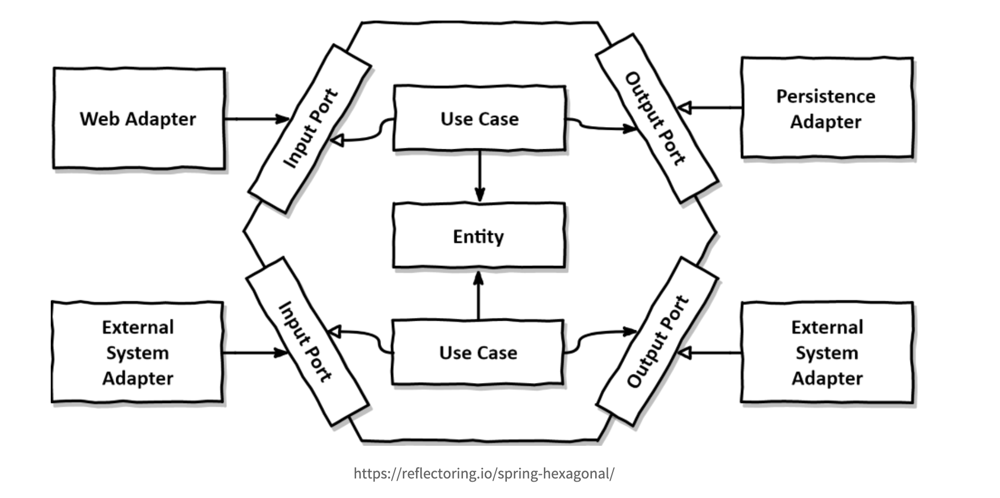
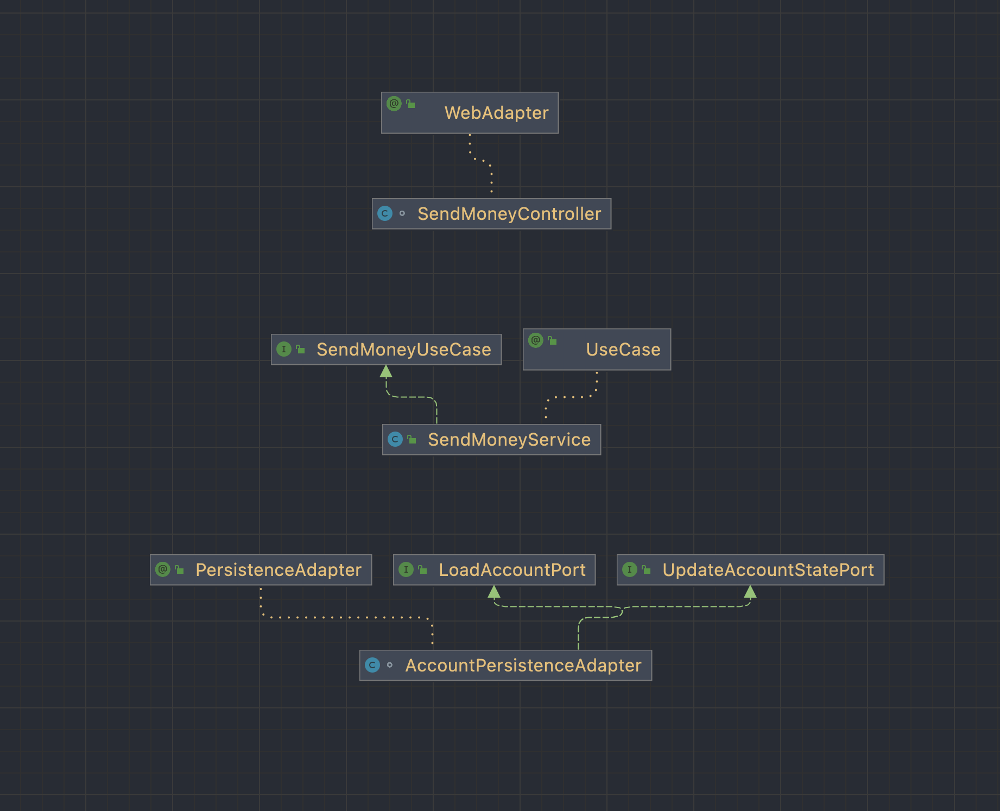

## ✍🏻**Hexagonal architecture**
**인터페이스나 기반 요소의 변경에 영향을 받지 않는 핵심 코드를 만들고 견고하게 관리하는 것이 목표**

어느 기술블로그에서 **헥사고날 아키텍처** 내용을 다루는 글을 보고면서 레이어드 아키텍처에 익숙해져 있고 항상 그렇게 생각했던 부분과 많이 달라 이해하는게 힘들었고
아직도 정확하게 이해하지 못하고 있는 것 같아, 정리를 위해 글을 작성하게되었습니다.

직접 사용해보려고 개인프로젝트에 적용중인데 이렇게 하는게 맞는지 아직은 모르겠지만, 사용해보고 후기를 작성해볼 예정입니다.

- [Hexagonal architecture (software)](https://en.wikipedia.org/wiki/Hexagonal_architecture_(software)#:~:text=The%20hexagonal%20architecture%2C%20or%20ports,means%20of%20ports%20and%20adapters.)

### Port & Adapter, Hexagonal Architecture
헥사고날 아키첵처는 아래 그림과 같이 포트와 어댑터로 구성되어 있습니다.

| **모듈명**   | **설명**                                | **예시**             |   |   |
|-----------|---------------------------------------|--------------------|---|---|
| 인바운드 어댑터  | 외부에서 들어온 요청을 인바운드 포트를 호출해 처리          | Rest API           |   |   |
| 아웃바운드 어댑터 | 비즈니스 로직에서 들어온 내용을 외부 혹은 / 서비스를 호출해 처리 | Database           |   |   |
| 인바운트 포트   | 도메인 코드에 접근하기 위한 인터페이스 클래스             | Endpoint -> Domain |   |   |
| 아웃바운드 포트  | 도메인 코드에 접근하기 위한 인터페이스 클래스             | Domain -> Endpoint |   |   |
| 서비스       | 실제 도메인 내용을 처리하는 코드                    | UseCase            |   |   |  

--- 
내부로(Rest, Graphql, RPC) 들어오는 요청과 처리 후 외부(Database, 외부 서비스) 로 내보내는 부분은 모두 **Adapter**를 통해 처리가 진행되고, 처리는 **Port(Interface)** 를 구현한 구현체(UseCase)에서 처리가되는 구조입니다.  

[Hexagonal architecture 구조로 만들어지 Spring boot](https://github.com/thombergs/buckpal) 에 구현 내용을 참고해보면 아래와 같습니다.

외부에서 요청이 들어오는 Controller, 비즈니스 로직이 있는 SendMoenyService, 도메인에 접근하기 위한 Port 그리고 Port를 구현한 구현체 Adapter   
Github에서 다른 예체를 찾아봤을 때 조금은 다르게 구현된 예제도 있었지만 Star가 제일 많은 예체를 참고했습니다.

### 헷갈리는 부분

### 마무리

### Reference
- [Hexagonal architecture](https://alistair.cockburn.us/hexagonal-architecture/)
- [헥사고날 아키텍쳐(Hexagonal Architecture)](https://blog.imqa.io/hexagonal-architecture/)
- [지속 가능한 소프트웨어 설계 패턴: 포트와 어댑터 아키텍처 적용하기](https://engineering.linecorp.com/ko/blog/port-and-adapter-architecture/)
- [쉽게 설명한 클린 / 헥사고날 아키텍쳐](https://haandol.github.io/2022/02/13/demystifying-hexgagonal-architecture.html)
